# Dev Task Plan: Pasargad Prints E-commerce Platform Implementation

**Generated**: 2025-07-07 10:34:15  
**Target**: CLAUDE.md (pasargadprints e-commerce platform requirements)  
**Status**: Backend ~85% complete, Frontend ~70% complete, Testing minimal

## Overview

### Implementation Strategy
The pasargadprints e-commerce platform follows a modern full-stack architecture with Django REST Framework backend and React frontend. The current implementation has substantial progress in backend infrastructure and frontend components but requires completion of key features and comprehensive testing.

**Current Architecture:**
- **Backend**: Django 4.2.7 + Django REST Framework with PostgreSQL
- **Frontend**: React 19.1.0 + TypeScript + Zustand + Tailwind CSS
- **Integrations**: Stripe payments (implemented), GoShippo shipping (partially implemented)
- **Deployment**: Docker containerization ready

### Testing Strategy
- **Backend Testing**: Django TestCase for models, DRF APITestCase for endpoints, mock testing for external APIs
- **Frontend Testing**: Jest + React Testing Library for components, Cypress for E2E user flows
- **Integration Testing**: Full checkout flow, payment processing, shipping calculations
- **Coverage Target**: 85% code coverage minimum

### Key Technical Decisions
1. **State Management**: Zustand for React (already implemented)
2. **Authentication**: Token-based auth with Django REST Framework
3. **Database**: PostgreSQL with proper indexing for performance
4. **File Storage**: Local media storage (configurable for cloud)
5. **Payment Flow**: Stripe Checkout Sessions for security
6. **Shipping**: Real-time rate calculation with GoShippo API

## Tasks

### Backend Tasks (Django)

#### Core Infrastructure
- **B001**: Configure environment variables and secrets management
  - Type: feature
  - Status: pending
  - Dependencies: []

- **B002**: Implement comprehensive Django settings for production
  - Type: feature  
  - Status: pending
  - Dependencies: [B001]

- **B003**: Add database migrations for production deployment
  - Type: feature
  - Status: pending
  - Dependencies: [B002]

#### API Enhancements
- **B004**: Complete Stripe webhook signature verification
  - Type: feature
  - Status: pending
  - Dependencies: [B001]

- **B005**: Implement GoShippo shipping label generation for admin
  - Type: feature
  - Status: pending
  - Dependencies: [B001]

- **B006**: Add order status update endpoints
  - Type: feature
  - Status: pending
  - Dependencies: []

- **B007**: Implement product search and filtering API
  - Type: feature
  - Status: pending
  - Dependencies: []

#### Admin Panel
- **B008**: Customize Django admin for product management
  - Type: feature
  - Status: pending
  - Dependencies: []

- **B009**: Add shipping label generation action in order admin
  - Type: feature
  - Status: pending
  - Dependencies: [B005]

- **B010**: Implement order management dashboard for admin
  - Type: feature
  - Status: pending
  - Dependencies: [B006]

### Frontend Tasks (React)

#### Checkout Flow
- **F001**: Complete checkout form with shipping rate selection
  - Type: feature
  - Status: pending
  - Dependencies: [B005]

- **F002**: Integrate Stripe payment processing
  - Type: feature
  - Status: pending
  - Dependencies: [B004]

- **F003**: Implement order confirmation and success pages
  - Type: feature
  - Status: pending
  - Dependencies: [F002]

#### Product Management
- **F004**: Add product search and filtering interface
  - Type: feature
  - Status: pending
  - Dependencies: [B007]

- **F005**: Implement product image gallery and zoom
  - Type: feature
  - Status: pending
  - Dependencies: []

- **F006**: Add product reviews and ratings system
  - Type: feature
  - Status: pending
  - Dependencies: []

#### User Experience
- **F007**: Complete user dashboard with order history
  - Type: feature
  - Status: pending
  - Dependencies: [B006]

- **F008**: Implement responsive mobile design
  - Type: feature
  - Status: pending
  - Dependencies: []

- **F009**: Add loading states and error handling
  - Type: feature
  - Status: pending
  - Dependencies: []

### Testing Tasks

#### Backend Testing
- **T001**: Write model tests for all Django models
  - Type: test
  - Status: pending
  - Dependencies: []

- **T002**: Create API endpoint tests with authentication
  - Type: test
  - Status: pending
  - Dependencies: [T001]

- **T003**: Mock test Stripe integration scenarios
  - Type: test
  - Status: pending
  - Dependencies: [B004]

- **T004**: Mock test GoShippo integration scenarios
  - Type: test
  - Status: pending
  - Dependencies: [B005]

- **T005**: Test order fulfillment workflow
  - Type: test
  - Status: pending
  - Dependencies: [T003, T004]

#### Frontend Testing
- **T006**: Write component tests for all React components
  - Type: test
  - Status: pending
  - Dependencies: []

- **T007**: Create integration tests for API interactions
  - Type: test
  - Status: pending
  - Dependencies: [T002]

- **T008**: Implement E2E tests for complete user journeys
  - Type: test
  - Status: pending
  - Dependencies: [F001, F002, F003]

- **T009**: Add performance testing for frontend components
  - Type: test
  - Status: pending
  - Dependencies: [T006]

### Deployment Tasks

#### Infrastructure
- **D001**: Configure Docker production settings
  - Type: feature
  - Status: pending
  - Dependencies: [B002]

- **D002**: Set up CI/CD pipeline with GitHub Actions
  - Type: feature
  - Status: pending
  - Dependencies: [D001]

- **D003**: Configure environment-specific settings
  - Type: feature
  - Status: pending
  - Dependencies: [B001]

#### Documentation
- **D004**: Create comprehensive README with setup instructions
  - Type: docs
  - Status: pending
  - Dependencies: [D001]

- **D005**: Document API endpoints and usage
  - Type: docs
  - Status: pending
  - Dependencies: [B002]

- **D006**: Create deployment guide
  - Type: docs
  - Status: pending
  - Dependencies: [D002]

### Security & Performance

#### Security
- **S001**: Implement rate limiting for API endpoints
  - Type: feature
  - Status: pending
  - Dependencies: []

- **S002**: Add input validation and sanitization
  - Type: feature
  - Status: pending
  - Dependencies: []

- **S003**: Configure CORS and security headers
  - Type: feature
  - Status: pending
  - Dependencies: [B002]

#### Performance
- **P001**: Implement database query optimization
  - Type: refactor
  - Status: pending
  - Dependencies: []

- **P002**: Add caching for product listings
  - Type: feature
  - Status: pending
  - Dependencies: [P001]

- **P003**: Optimize frontend bundle size
  - Type: refactor
  - Status: pending
  - Dependencies: []

## Dependency Diagram

```mermaid
graph TD
    %% Backend Infrastructure
    B001[B001: Environment Variables] --> B002[B002: Production Settings]
    B002 --> B003[B003: Database Migrations]
    B001 --> B004[B004: Stripe Webhook Verification]
    B001 --> B005[B005: GoShippo Label Generation]
    
    %% API Dependencies
    B005 --> B009[B009: Admin Shipping Actions]
    B006[B006: Order Status Updates] --> B010[B010: Admin Dashboard]
    
    %% Frontend Dependencies
    B005 --> F001[F001: Checkout Flow]
    B004 --> F002[F002: Stripe Integration]
    F002 --> F003[F003: Order Confirmation]
    B007[B007: Product Search API] --> F004[F004: Product Search UI]
    B006 --> F007[F007: User Dashboard]
    
    %% Testing Dependencies
    T001[T001: Model Tests] --> T002[T002: API Tests]
    B004 --> T003[T003: Stripe Tests]
    B005 --> T004[T004: GoShippo Tests]
    T003 --> T005[T005: Order Fulfillment Tests]
    T004 --> T005
    
    T002 --> T007[T007: API Integration Tests]
    F001 --> T008[T008: E2E Tests]
    F002 --> T008
    F003 --> T008
    T006[T006: Component Tests] --> T009[T009: Performance Tests]
    
    %% Deployment Dependencies
    B002 --> D001[D001: Docker Production]
    D001 --> D002[D002: CI/CD Pipeline]
    B001 --> D003[D003: Environment Config]
    D001 --> D004[D004: README Documentation]
    
    %% Security Dependencies
    B002 --> S003[S003: CORS & Security Headers]
    
    %% Performance Dependencies
    P001[P001: Database Optimization] --> P002[P002: Product Caching]
    
    %% Critical Path (highlighted)
    classDef critical fill:#ff6b6b,stroke:#333,stroke-width:2px
    classDef important fill:#4ecdc4,stroke:#333,stroke-width:2px
    classDef testing fill:#ffe66d,stroke:#333,stroke-width:2px
    
    class B001,B004,B005,F001,F002,F003 critical
    class T003,T004,T005,T008 testing
    class D001,D002,S001,S002 important
```

## Clarifications

### Requirements Ambiguities
1. **Payment Methods**: Only Stripe card payments specified - should we support other payment methods (PayPal, Apple Pay, etc.)?

2. **Shipping Scope**: Currently US-only shipping addresses - should international shipping be supported?

3. **Product Customization**: Requirements mention "custom 3D printed items" - what level of customization options should be available?

4. **User Roles**: Admin functionality mentioned but user role hierarchy not clearly defined - should there be manager/staff roles?

5. **Inventory Management**: Stock management exists but supplier/vendor management not specified - is this a single-vendor platform?

### Technical Specifications
1. **File Storage**: Should product images be stored in cloud storage (AWS S3, CloudFlare) or local storage for production?

2. **Email System**: Order confirmation emails mentioned but email service provider not specified - should we use SendGrid, AWS SES, or SMTP?

3. **Analytics**: No analytics requirements specified - should we implement order tracking, user behavior analytics?

4. **Mobile Apps**: Only web application specified - are native mobile apps planned for future?

5. **Multi-language**: Customer model has language preferences but no localization requirements specified

### Integration Details
1. **Stripe Configuration**: Which Stripe features should be enabled (subscriptions, connect, etc.)?

2. **GoShippo Carriers**: Which shipping carriers should be supported beyond USPS and UPS?

3. **Tax Calculation**: No tax calculation requirements specified - should we integrate with tax services?

4. **Address Validation**: Should we implement address validation beyond basic US format checking?

---

## 中文报告

### 总体策略
pasargadprints电商平台采用现代全栈架构，Django REST Framework后端配合React前端。当前实现在后端基础设施和前端组件方面进展显著，但需要完成关键功能和综合测试。

**当前架构:**
- **后端**: Django 4.2.7 + Django REST Framework + PostgreSQL
- **前端**: React 19.1.0 + TypeScript + Zustand + Tailwind CSS  
- **集成**: Stripe支付（已实现），GoShippo运输（部分实现）
- **部署**: Docker容器化就绪

### 测试方法论
- **后端测试**: Django TestCase模型测试，DRF APITestCase端点测试，外部API模拟测试
- **前端测试**: Jest + React Testing Library组件测试，Cypress端到端测试
- **集成测试**: 完整结账流程、支付处理、运费计算
- **覆盖目标**: 最低85%代码覆盖率

### 关键技术决策
1. **状态管理**: React使用Zustand（已实现）
2. **身份验证**: Django REST Framework基于令牌的认证
3. **数据库**: PostgreSQL，适当索引优化性能
4. **文件存储**: 本地媒体存储（可配置云存储）
5. **支付流程**: Stripe Checkout Sessions确保安全性
6. **运输**: GoShippo API实时运费计算

### 任务清单
核心任务包括：
- 后端基础设施完善（环境变量配置、生产设置）
- API增强（Stripe webhook验证、GoShippo标签生成）
- 前端结账流程完成（运费选择、支付集成）
- 全面测试实现（模型测试、API测试、E2E测试）
- 部署准备（Docker生产配置、CI/CD流水线）

### 依赖关系图
关键路径包括环境变量配置 → 生产设置 → Stripe/GoShippo集成 → 前端结账流程 → 测试验证 → 部署准备

### 待确认问题
1. **支付方式**: 是否支持Stripe以外的支付方式？
2. **运输范围**: 是否支持国际运输？
3. **产品定制**: 3D打印产品定制程度如何？
4. **用户角色**: 管理员功能层次结构需明确
5. **库存管理**: 是否需要供应商/供应商管理？

**保存路径**: `/Users/farzahnfarange/Documents/Development/django-ecom/docs/workspaces/task-plan-07-07-10-34-15.md`